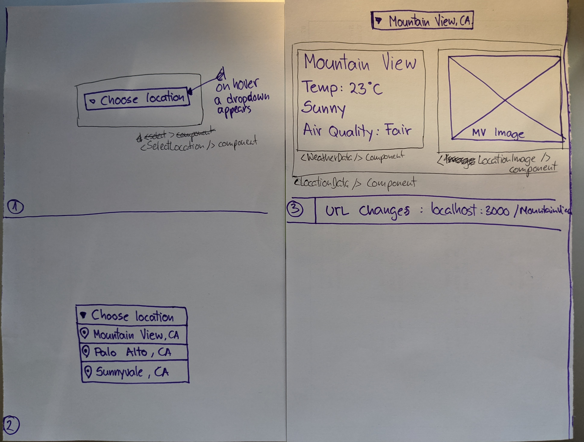
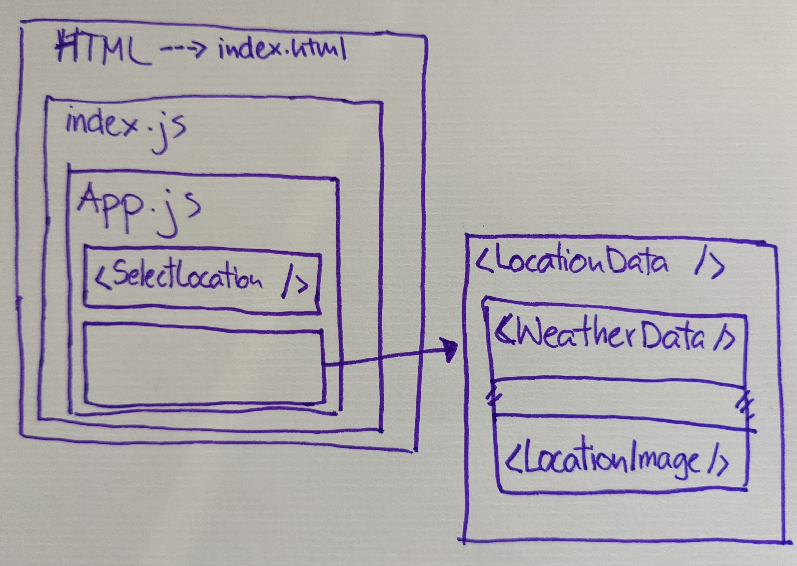

# Goal
- Goal of this app is for me to learn how to project manage my work and how to create React components, pass data
 around and also how to use omnibox API.
 
# Diagram
1. Choose a location.
2. View a weather data for the chosen location.

- Option to type a location in the omnibox and correct weather data displays.

# Wireframe
- 

# To Do
- [x] [Create issues on GitHub.](https://github.com/MaretIdris/react-and-pm
-learning/issues)
- [x] Estimate time frames.
- [ ] Build the app.

# index.js
- `index.js` file inserts the React app, `App.js` file, to html. React's Shadow
 DOM
 selects
 the
 root element from the DOM API and inserts the React app in it. 
 
 ```jsx
ReactDOM.render(
  <React.StrictMode>
    <App />
  </React.StrictMode>,
  document.getElementById('root')
);

```

# App.js
- `App.js` is the first component. All components start with a capital letter
. This is how the nested components come together with HTML. 


# Amend this commit to the previous commit
- Run in the terminal
- Stage files: 
  - `git add -A`
- Commit and amend files:
  - `git commit --amend --no-edit ; git push -f`
  
# Leave HTML `<select>` option blank
- [StackOverflow article: default select option as blank](https://stackoverflow.com/questions/8605516/default-select-option-as-blank)

# Is JSON a string?
- JSON is a **text-based data format** following JavaScript object syntax. JSON
 exists as a string — **useful when you want to transmit data across a
  network**. 
- It needs to be converted to a native JavaScript object when you
   want to access the data.
   
- [MDN article on JSON](https://developer.mozilla.org/en-US/docs/Learn/JavaScript/Objects/JSON)
- You can include the same basic data types inside JSON as you can in a standard JavaScript object — strings, numbers, arrays, booleans, and other object literals.
 
 
# DOM API
- Browser and HTML and JS 
- Whomever made the browser is providing the DOM API. Chrome browser makers
 make DOM for Chrome, Safari browser makers make the DOM API in Safari browser.
- DOM API is for me, the web developer, to interact with the browser from my
 JS files, which I link to my HTML. Browser will take my index.html file. 
- I write HTML and I embed my JS link to my HTML. I then can get information
 about browser history, can access and manipulate the DOM elements and form
  data etc. [Read more here](https://developer.mozilla.org/en-US/docs/Web/API/HTML_DOM_API)
   
   
# Amend to previous commit
```
git add -A ; git commit --amend --no-edit ; git push -f

```